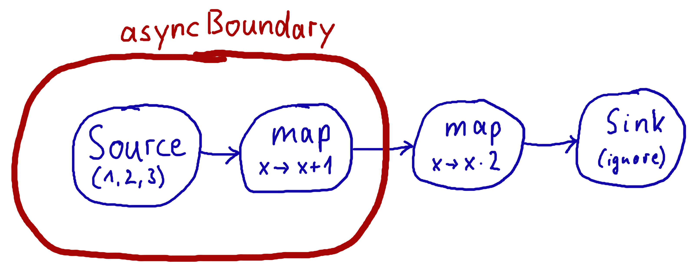

# 基础知识和使用Flow

## 依赖

要使用Akka流，请将模块添加到您的项目中：

@@dependency[sbt,Maven,Gradle] {
  group="com.typesafe.akka"
  artifact="akka-stream_$scala.binary_version$"
  version="$akka.version$"
}

## 介绍

## 核心概念

Akka流是一个使用有限的缓冲区空间处理和传输元素序列的库。后一个属性就是我们所说的 *boundedness*，它是Akka流的定义特征。翻译成日常用语，可以表示处理实体的链(或后文中的图)。这些实体中的每一个都独立于其他实体执行(并可能并发执行)，同时在任何给定时间仅缓冲有限数量的元素。
有界缓冲区的这个属性是与actor模型的区别之一，在actor模型中，每个actor通常都有一个无界或有界，但正在丢弃的邮箱。Akka流处理实体已绑定了不会丢失的"邮箱"。

在继续之前，让我们定义一些基本术语，这些术语将在整个文档中使用：

流
: 一个活跃的过程，涉及移动和转换数据。

元素
: 一个元素是流的处理单元。所有操作都改变和转换元素，从上游到下游。缓冲区大小通常表示为元素的数量，与元素的实际大小无关。

背压
: flow控制的一种方法，一种数据的消费者将其当前可用性通知生产者的方法，从而有效地减慢了上游生产者的速度以适应其消费速度。在Akka流上下文中，背压始终被理解为 *非阻塞* 和 *异步的*。

非阻塞
: 意味着某个操作不会妨碍调用线程的进度，即使是需要很长时间完成请求的操作。

图
: 流处理拓扑的描述，定义了流运行时元素流经的路径。

运算符
: 构成图的所有构建块的通用名称。运算符的例子是`map()`，`filter()`，自定义的扩展 @ref[`GraphStage`](stream-customize.md)和图交叉点如`Merge`或`Broadcast`。有关内置运算符的完整列表，请参见 @ref:[运算符索引](operators/index.md)

当我们谈论 *异步，非阻塞背压* 时，我们的意思是Akka流中可用的运算符将不使用阻塞调用，而是使用异步消息传递在彼此之间交换消息。通过这种方式，它们可以降低快速生产者的速度，而不阻塞它的线程。这是一种线程池友好的设计，因为需要等待的实体(快速的生产者等待缓慢的消费者)不会阻塞线程，而是可以将它交给底层线程池以供将来使用。

## 定义和运行流

可以使用以下核心抽象在Akka流中表示线性处理管道：

Source
: 一个 *恰好一个输出* 的运算符，只要下游运算符准备好接收它们，就发出数据元素。

Sink
: 一个 *恰好一个输入* 的运算符，请求和接受数据元素，可能会减慢元素的上游生产者的速度。

Flow
: 一个 *恰好一个输入和输出* 的运算符，它通过转换流经它的数据元素来连接其上游和下游。

RunnableGraph
: 一个Flow的两端分别"附加"到源和接收器，并准备`run()`。

可以将一个`Flow`附加到一个`Source`产生一个复合源，也可以在`Sink`之前加上一个`Flow`来得到一个新的Sink。当一个流通过同时拥有一个源和一个接收器而正确地终止后，它将由`RunnableGraph`类型表示，这表明它已经准备好执行了。

重要的是要记住，即使通过连接所有的源、接收器和不同的运算符构造了`RunnableGraph`之后，也不会有数据流经它，直到它被物化。物化是分配运行图描述的计算所需的所有资源的过程(在Akka流中，这通常涉及启动Actor)。由于Flow是对处理管道的描述，因此它们是 *不可变的，线程安全的和可自由共享的*，这意味着例如可以安全地在actors之间共享和发送它们，让一个actor准备工作，然后让它在代码中完全不同的地方物化。

Scala
:   @@snip [FlowDocSpec.scala](/akka-docs/src/test/scala/docs/stream/FlowDocSpec.scala) { #materialization-in-steps }

Java
:   @@snip [FlowDocTest.java](/akka-docs/src/test/java/jdocs/stream/FlowDocTest.java) { #materialization-in-steps }

@@@ div { .group-scala }

运行(物化)`RunnableGraph[T]`后，我们将获得类型T的物化值。每个流运算符都可以产生物化值，用户有责任将它们组合成一个新类型。在上面的示例中，我们使用`toMat`来表示我们想要转换的源和接收器的物化值，并且使用便利函数`Keep.right`来表示我们只对接收器的物化值感兴趣。

在我们的示例中，`FoldSink`物化了一个`Future`类型的值，它表示流折叠过程的结果。通常，流可以暴露多个物化值，但是仅对流中的`Source`或`Sink`的值感兴趣是很常见的。由于这个原因，一个称为`runWith()`的便捷方法可用于`Sink`，`Source`或`Flow`的需求，分别供给`Source`(为了运行一个`Sink`)，`Sink`(为了运行一个`Source`)或两者`Source`和`Sink`(为了运行一个`Flow`，因为它两者都均未连上)。

@@@

@@@ div { .group-java }

After running (materializing) the `RunnableGraph` we get a special container object, the `MaterializedMap`. Both
sources and sinks are able to put specific objects into this map. Whether they put something in or not is implementation
dependent. 

For example a `FoldSink` will make a `CompletionStage` available in this map which will represent the result
of the folding process over the stream.  In general, a stream can expose multiple materialized values,
but it is quite common to be interested in only the value of the Source or the Sink in the stream. For this reason
there is a convenience method called `runWith()` available for `Sink`, `Source` or `Flow` requiring, respectively,
a supplied `Source` (in order to run a `Sink`), a `Sink` (in order to run a `Source`) or
both a `Source` and a `Sink` (in order to run a `Flow`, since it has neither attached yet).
@@@

Scala
:   @@snip [FlowDocSpec.scala](/akka-docs/src/test/scala/docs/stream/FlowDocSpec.scala) { #materialization-runWith }

Java
:   @@snip [FlowDocTest.java](/akka-docs/src/test/java/jdocs/stream/FlowDocTest.java) { #materialization-runWith }

值得指出的是，由于运算符是 *不可变的* ，连接它们将返回一个新的运算符，而不是修改现有实例，因此在构造长flows时，请记住将新值分配给变量或运行它：

Scala
:   @@snip [FlowDocSpec.scala](/akka-docs/src/test/scala/docs/stream/FlowDocSpec.scala) { #source-immutable }

Java
:   @@snip [FlowDocTest.java](/akka-docs/src/test/java/jdocs/stream/FlowDocTest.java) { #source-immutable }

@@@ note

默认情况下，Akka流元素仅支持 **恰好一个** 下游运算符。通过将扇出(支持多个下游运算符)作为一个显式的扇入功能，可以使默认流元素更简单和更高效。此外，它还提供了更大的灵活性来处理多播场景，它通过提供命名的扇出元素，例如broadcast(向所有下游元素发出信号)，或balance(向其中一个可用的下游元件发出信号)

@@@

在上面的示例中，我们使用了`runWith`方法，它既物化了流又返回了给定接收器或源的物化值。

由于可以多次物化一个流，因此对于每个这样的实现，物化值也将重新计算，通常会导致每次返回不同的值。在下面的示例中，我们创建了在`runnable`变量中描述的流的两个正在运行的物化实例。这两个物化从map给了我们一个不同的 @scala[`Future`] @java[`CompletionStage`]，尽管我们使用相同的`sink`来引用future:

Scala
:   @@snip [FlowDocSpec.scala](/akka-docs/src/test/scala/docs/stream/FlowDocSpec.scala) { #stream-reuse }

Java
:   @@snip [FlowDocTest.java](/akka-docs/src/test/java/jdocs/stream/FlowDocTest.java) { #stream-reuse }

### 定义sources，sinks和flows

对象`Source`和`Sink`定义了创建元素sources和sinks的不同方式。以下示例显示了一些最有用的构造(有关更多详细信息，请参阅API文档)：

Scala
:   @@snip [FlowDocSpec.scala](/akka-docs/src/test/scala/docs/stream/FlowDocSpec.scala) { #source-sink }

Java
:   @@snip [FlowDocTest.java](/akka-docs/src/test/java/jdocs/stream/FlowDocTest.java) { #source-sink }

连接一个流的不同部分有多种方法，以下示例显示了一些可用的选项：

Scala
:   @@snip [FlowDocSpec.scala](/akka-docs/src/test/scala/docs/stream/FlowDocSpec.scala) { #flow-connecting }

Java
:   @@snip [FlowDocTest.java](/akka-docs/src/test/java/jdocs/stream/FlowDocTest.java) { #flow-connecting }

### 非法流元素

根据响应流规范([规则2.13](https://github.com/reactive-streams/reactive-streams-jvm#2.13))，Akka流不允许`null`作为一个元素通过流传递。如果您想对不存在值的概念建模，我们建议使用 @scala[`scala.Option`或`scala.util.Either`]。

## 背压说明

Akka流实现了由[响应流](http://reactive-streams.org/)规范标准化的一个异步无阻塞背压协议，Akka是该规范的创始成员。

库的用户不必编写任何显式的背压处理代码 - 它是内置的，并且由所有提供的Akka流运算符自动处理。
但是，可以添加具有溢出策略的显式缓冲区运算符，它可以影响流的行为。
这对于复杂的处理图尤其重要，因为它甚至可能包含循环(那些 *必须* 特别小心地处理，如 @ref:[图周期, 活跃性和死锁](stream-graphs.md#graph-cycles)中所述)。

背压协议是根据下游`Subscriber`能够接收和缓冲的元素数目定义的，参考`demand`。数据的源，在响应流术语中称为`Publisher`，在Akka流中实现为`Source`，保证它永远不会发出比任何给定`Subscriber`接收的总需求更多的元素。

@@@ note

响应流规范根据`Publisher`和`Subscriber`定义它的协议。这些类型并 **不** 意味着是面向用户的API，而是作为不同响应流实现的低级构建块。

Akka流将这些概念实现为`Source`，`Flow`(在响应流中称为`Processor`)和`Sink`，没有直接公开响应流接口。如果您需要与其他响应流库集成，请阅读 @ref:[与响应流集成](stream-integrations.md#reactive-streams-integration)。

@@@

响应流背压的工作模式可以通俗地描述为"动态推/拉模式"，因为它将根据下游是否能够应付上游的生产速度，在推和拉的背压模式之间进行切换。

为了进一步说明这一点，让我们考虑两个问题情境，以及背压协议如何处理它们:

### 发布者慢，订阅者快

这是理想的情况 – 在这种情况下，我们不需要放慢发布者的速度。
然而，信号速度很少是恒定的，并且可能在任何时间点发生变化，最终会导致订阅方的速度比发布方慢。为了避免这些情况，在这种情况下仍然必须启用背压协议，但是我们不希望为启用这个安全网付出高昂的代价。

响应流协议通过从订阅者发送异步信号 @scala[`Request(n:Int)`]@java[`Request(int n)`]到发布者来解决此问题。该协议保证了发布者永远不会发送比信号的需求更多的元素。

但是，由于订阅者当前更快，它将以更高的频率发送这些请求消息(可能还会将需求批量处理 - 在一个请求信号中请求多个元素)。这意味着发布者永远不必等待(被背压)发布其传入的元素。

如我们所见，在这种情况下，我们可以在所谓的推模式下有效地运作。因为发布者可以用它最快的速度继续生产元素，挂起的需求将在发出元素时及时恢复。

### 发布者快，订阅者慢

需要对`Publisher`进行背压时就是这种情况，因为`Subscriber`不能应付其上游想要发射数据元素的速度。

由于`Publisher`不允许发出比`Subscriber`挂起的需求更多的元素，因此它将不得不通过应用以下策略之一来承受这种背压：

 * 不生成元素，如果能够控制它的生产速度
 * 尝试以 *有界的* 方式缓冲元素，直到发出更多需求，
 * 删除元素，直到发出更多需求，
 * 请拆除该流，如果无法应用上述任何策略。

正如我们所看到的，这个场景实际上意味着`Subscriber`将从发布者 *拉* 元素 - 这种操作方式被称为基于拉的背压。

## 流物化(Materialization)

当在Akka流中构建流和图时，可以将它们看作是准备一个蓝图，一个执行计划。流物化是获取流描述(`RunnableGraph`)并分配它运行所需的所有必要资源的过程。对于Akka流，这通常意味着启动支持处理的Actor，但不仅限于此 - 还可能意味着打开文件或套接字连接等，具体取决于流的需求。

物化在所谓的"终点操作"处触发。最显著的是，这包括在`Source`和`Flow`元素上定义的各种形式的`run()`和`runWith()`方法，以及少量特殊的语法糖，用于与众所周知的接收器一起运行，例如`runForeach(el => ...)`是`runWith(Sink.foreach(el => ...))`的别名。

物化是由一个`ActorSystem`的全局`Materializer`在物化线程上同步执行的。实际的流处理由在流物化过程中启动的actor负责的，这些actor将在为它们运行而配置的线程池上运行 - 它默认设置为在`ActorSystem`配置中设置的dispatcher，或者作为将要物化的流的属性提供。

@@@ note

在组合图内重用线性计算运算符(Source, Sink, Flow)的 *实例* 是合法的，但会多次物化该运算符。

@@@

### 运算符融合

默认情况下，Akka流将融合流运算符。这意味着一个flow或流的处理步骤可以在同一Actor中执行，并且有两个结果：

 * 由于避免了异步消息传递开销，在融合运算符之间将元素从一个运算符传递到下一个运算符要快得多
 * 融合流运算符不能彼此并行运行，这意味着每个融合部分最多只能使用一个CPU内核

为了支持并行处理，您必须手动将异步边界插入到flows和运算符中，通过添加`Attributes.asyncBoundary`的方式，使用`Source`,`Sink`和`Flow`上的`async`方法到运算符，它将以异步方式与图的下游通信。

Scala
:   @@snip [FlowDocSpec.scala](/akka-docs/src/test/scala/docs/stream/FlowDocSpec.scala) { #flow-async }

Java
:   @@snip [FlowDocTest.java](/akka-docs/src/test/java/jdocs/stream/FlowDocTest.java) { #flow-async }

在此示例中，我们在流中创建两个区域，每个区域将在一个Actor中执行 - 假设整数的相加和相乘是一个非常昂贵的操作，这将导致性能提升，因为两个CPU可以并行处理任务。重要的是要注意，异步边界不是一个flow - 元素在其中异步传递 - 中的单个位置(就像在其他流式库中一样)，相反，属性总是通过向flow图添加信息来起作用，而该信息已被构建到这个点

这意味着红色气泡内的所有内容都将由一个actor执行，它外面的所有内容将由另一个actor执行。这个方案可以连续应用，始终有一个这样的边界，包括前面的一个边界，再加上之后添加的所有运算符。

@@@ warning

在不融合的情况下(即版本2.0-M2之前)，每个流运算符都有一个隐式输入缓冲区，出于效率考虑，该缓冲区保存一些元素。如果flow图包含循环，那么为了避免死锁，这些缓冲区可能是至关重要的。通过融合，这些隐式缓冲区不再存在，数据元素在融合的操作符之间传递时不需要缓冲。在那些需要缓冲以使流能够完全运行的情况下，您必须使用`.buffer()` 操作符插入显式缓冲区 - 通常情况下，一个大小为2的缓冲区就足以允许一个反馈循环发挥作用。

@@@

### 组合物化值

由于Akka流中的每个运算符在被物化之后都可以提供一个物化的值，因此当我们将这些运算符连接在一起时，有必要以某种方式表达这些值应如何组合成一个最终值。为此，许多运算符方法都有一些变体，它们接受一个额外的参数，即一个函数，该函数将用于合并结果值。下面的示例说明了使用这些组合器的一些示例。

Scala
:   @@snip [FlowDocSpec.scala](/akka-docs/src/test/scala/docs/stream/FlowDocSpec.scala) { #flow-mat-combine }

Java
:   @@snip [FlowDocTest.java](/akka-docs/src/test/java/jdocs/stream/FlowDocTest.java) { #flow-mat-combine }

@@@ note

在图中，可以从流内部访问物化的值。有关详细信息，请参见 @ref:[访问图内的物化值](stream-graphs.md#graph-matvalue)。

@@@

### 源预物化

有些情况下，你在`Source`连接到图的其余部分 **之前** 就需要一个`Source`物化值。这在"物化值驱动"`Source`的情况下是特别有用，像`Source.queue`，`Source.actorRef`或`Source.maybe`。

通过对一个`Source`使用`preMaterialize`运算符，您可以获得它的物化值和另一个`Source`。后者可用于消费来自原始`Source`的消息。请注意，这可以多次物化。

Scala
:   @@snip [FlowDocSpec.scala](/akka-docs/src/test/scala/docs/stream/FlowDocSpec.scala) { #source-prematerialization }

Java
:   @@snip [FlowDocTest.java](/akka-docs/src/test/java/jdocs/stream/FlowDocTest.java) { #source-prematerialization }

## 流排序

在Akka流中，几乎所有计算运算符都 *保持元素的输入顺序* 。这意味着，如果输入 `{IA1,IA2,...,IAn}`"导致"输出`{OA1,OA2,...,OAk}`，以及输入`{IB1,IB2,...,IBm}`"导致"输出`{IB1,IB2,...,IBm}`，且所有`IAi`发生在所有`IBi`之前，然后`OAi`发生在`OBi`之前。

该属性甚至可以通过异步操作来维护，例如`mapAsync`，但是存在一个不排序的版本`mapAsyncUnordered`，该版本不会保留此排序。

然而，在交叉点的情况下，处理多个输入流(例如`Merge`)，对于从不同输入端口到达的元素，输出顺序通常是 *未定义* 。这是一个类似于合并的操作，在发出`Bi`之前可能会发出`Ai`，并由它的内部逻辑决定发射元素的顺序。然而，像`Zip`这样的特殊元素 *保证* 了它们的输出顺序，因为每个输出元素依赖于所有已经被标记的上游元素 - 因此，压缩时的排序是由这个属性定义的。

如果您发现自己需要对扇入场景中发出元素的顺序进行细粒度控制，请考虑使用 `MergePreferred`，`MergePrioritized`或 @ref[`GraphStage`](stream-customize.md) - 这将使您能够完全控制如何执行合并。

## Actor物化器生命周期

`Materializer`是一个组件，它负责将流蓝图转换为一个运行的流并发出"物化值"。
Akka Extension SystemMaterializer提供了一个ActorSystem范围内的Materializer，它通过来实现，这样就不需要担心Materializer，除非有特殊的要求。

一个`ActorSystem`视野内的`Materializer`是由Akka `Extension` `SystemMaterializer`提供的，通过作用域内一个隐式的`ActorSystem`，这样就不需要担心`Materializer`，除非有特殊要求。

可能需要一个自定义`Materializer`实例的用例是，当所有的流都在一个actor上物化的时候，都应该与actor生命周期绑定，并且在actor停止或崩溃时停止。

使流和actor一起工作的一个重要方面是理解`Materializer`的生命周期。物化器被绑定到创建它的`ActorRefFactory`的生命周期，在实践中它可以是一个`ActorSystem`或`ActorContext`(当物化器在一个`Actor`内部创建时)。

将它与`ActorSystem`搭配应该替换为使用Akka 2.6等版本中的系统物化器。

当由系统物化器运行时，流将一直运行，直到`ActorSystem`关闭。在流运行完成 *之前* 关闭物化器时，流将硬生生地终止。
这与通常终止流的方法略有不同，那是通过cancelling/completing它们。像这样将流生命周期绑定到物化器是为了防止泄漏。在正常操作中，您不应依赖该机制，而应使用`KillSwitch`或正常完成信号来管理流的生命周期。

如果我们看一下下面的例子，那里我们在一个`Actor`内部创建`Materializer`：

Scala
:   @@snip [FlowDocSpec.scala](/akka-docs/src/test/scala/docs/stream/FlowDocSpec.scala) { #materializer-from-actor-context }

Java
:   @@snip [FlowDocTest.java](/akka-docs/src/test/java/jdocs/stream/FlowDocTest.java) { #materializer-from-actor-context }

在上面的示例中，我们使用`ActorContext`来创建物化器。这将其生命周期绑定到周围环境中的`Actor`。换句话说，在正常情况下，我们从那里开始的流会一直运行，如果我们停止Actor，它也将终止流。我们已经将 *流的生命周期绑定到周围的actor的生命周期* 。如果流与actor紧密相关，这是一种非常有用的技术，例如，当actor代表一个用户或其他实体时，它使用创建的流不断地进行查询 – 而当actor已经终止时，让流继续存在是没有意义的。流终止将通过流发出的"突然终止异常"来指示。

您还可以通过显式调用一个`Materializer`的`shutdown()`方法来使其关闭，从而突然终止其当时正在运行的所有流。

然而，有时您可能想要显式地创建一个流，它会比actor的生命更长久。例如，您正在使用Akka流将一些大数据流推送到外部服务。您可能想急切地停止Actor，因为它已经履行了所有职责：

Scala
:   @@snip [FlowDocSpec.scala](/akka-docs/src/test/scala/docs/stream/FlowDocSpec.scala) { #materializer-from-system-in-actor }

Java
:   @@snip [FlowDocTest.java](/akka-docs/src/test/java/jdocs/stream/FlowDocTest.java) { #materializer-from-system-in-actor }

在上面的示例中，我们将物化器传递给Actor，这导致其生命周期绑定到整个`ActorSystem`而不是单个封闭的actor。这将很有用，如果您要共享一个物化器或将流分组到特定的物化器中，例如，由于物化器的设置等。

@@@ warning

不要通过传递`context.system`在actor中创建新的actor物化器。这将导致为每个这样的actor创建一个新的`Materializer`，并可能会泄露(除非你明确地关闭它)。相反，建议您传入物化器或使用actor的`context`创建一个。

@@@
