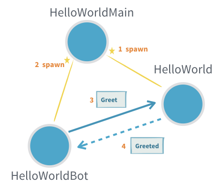
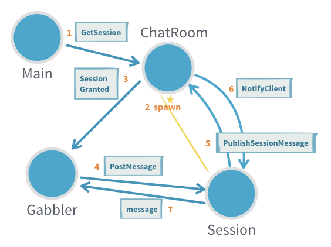

# Actor介绍

有关此功能的Akka经典文档请参,阅@ref:[Classic Actors](../actors.md).

## 模块信息

要使用Akka Actors，请在您的项目中添加以下依赖项：

@@dependency[sbt,Maven,Gradle] {
  group=com.typesafe.akka
  artifact=akka-actor-typed_$scala.binary_version$
  version=$akka.version$
}

Akka模块的Java和Scala DSL都捆绑在同一JAR中。为了获得流畅的开发体验，在使用诸如Eclipse或IntelliJ的IDE时，你可以在使用Scala时禁止自动导入器建议`javadsl`导入，反之亦然。请参阅IDE技巧 @ref:[IDE 技巧](../additional/ide.md)。

@@project-info{ projectId="akka-actor-typed" }

## Akka Actors

[Actor 模型](http://en.wikipedia.org/wiki/Actor_model)为编写并发和分布式系统提供了一个更高层次的抽象。它减轻了开发人员必须处理显式锁定和线程管理的麻烦，从而使编写正确的并发和并行系统更加容易。演员在1973年由卡尔·休伊特(Carl Hewitt)定义，但后来被Erlang语言所普及，例如，在爱立信中被广泛使用，用于构建高度并发且可靠的电信系统。Akka Actor的API已从Erlang借用了一些语法。
 
<a id="first-example"></a> 
## 第一个例子

如果您不熟悉Akka，则可能要先阅读 @ref:[入门指南](guide/introduction.md)，然后返回此处以了解更多信息。

熟悉Actor的基础，外部和内部生态系统是很有帮助的，可以看到您可以根据需要利用和定制什么，请参阅 @ref:[Actor System](../general/actor-systems.md)和 @ref:[Actor参考，路径和地址](../general/addressing.md)。

正如 @ref:[Actor Systems](../general/actor-systems.md)中讨论的那样，Actor是关于在独立的计算单元之间发送消息的，但是它看起来像什么呢？

在以下所有情况下，都假定这些导入:

Scala
:  @@snip [IntroSpec.scala](/akka-actor-typed-tests/src/test/scala/docs/akka/typed/IntroSpec.scala) { #imports }

Java
:  @@snip [IntroSpec.java](/akka-actor-typed-tests/src/test/java/jdocs/akka/typed/IntroTest.java) { #imports }

有了这些，我们可以定义我们的第一个Actor，它会说hello！


Scala
:  @@snip [IntroSpec.scala](/akka-actor-typed-tests/src/test/scala/docs/akka/typed/IntroSpec.scala) { #hello-world-actor }

Java
:  @@snip [IntroSpec.java](/akka-actor-typed-tests/src/test/java/jdocs/akka/typed/IntroTest.java) { #hello-world-actor }

这小段代码定义了两种消息类型，一种用于命令Actor向某人打招呼，另一种是Actor将用来确认它已这样做的消息。该`Greet`不仅包含要向谁打招呼的信息，还包含一个消息发件人提供的`ActorRef`，以便`HelloWorld`Actor可以发回确认消息。

Actor的行为在`receive`行为工厂的帮助下被定义为`Greeter`。然后，处理下一条消息可能会产生一种新的行为，该行为可能与此消息有所不同。通过返回拥有新的不可变状态的新行为来更新状态。在这种情况下，我们不需要更新任何状态，因此我们返回 @scala[`same`]@java[`this`]，这意味着下一个行为"与当前行为相同"。

将此行为处理的消息的类型已被声明为`Greet`类，这意味着`message`参数也是这样的类型。这就是为什么我们可以访问`whom`和`replyTo`成员而无需使用模式匹配的原因。通常，一个actor处理多个特定的消息类型，所有这些消息类型都直接或间接地扩展了一个公共特质。

在最后一行，我们看到`HelloWorld`Actor发送消息给向另一个Actor，该消息是使用`!`运算符完成的(发音为"bang"或"tell")。这是一个异步操作，不会阻塞调用者的线程。

由于该`replyTo`地址被声明为`ActorRef[Greeted]`类型，因此编译器仅允许我们发送此类型的消息，其他用法将发生一个编译器错误。

一个Actor的可接受消息类型以及所有应答类型定义了这个Actor所使用的协议；在这种情况下，它是一个简单的请求 - 答复协议，但是Actor可以在需要时对任意复杂的协议进行建模。该协议与实现它的行为捆绑在一起，在一个精心包装的范围内—`HelloWorld`对象。

正如卡尔·休伊特(Carl Hewitt)所说，一个Actor不是Actor-没人说话就太寂寞了。我们需要与`Greeter`互动的另一个Actor。让我们制作一个`HelloWorldBot`，从`Greeter`接收答复，并发送许多其他问候消息，也收集答复，直到达到给定的最大消息数量。



Scala
:  @@snip [IntroSpec.scala](/akka-actor-typed-tests/src/test/scala/docs/akka/typed/IntroSpec.scala) { #hello-world-bot }

Java
:  @@snip [IntroSpec.scala](/akka-actor-typed-tests/src/test/java/jdocs/akka/typed/IntroTest.java) { #hello-world-bot }

注意该Actor如何通过更改每个`Greeted`答复的行为而不是使用任何变量来管理计数器。由于Actor实例一次处理一个消息，因此不需要诸如`synchronized`或`AtomicInteger`的并发防护。

第三个actor产生(spawn)`Greeter`和`HelloWorldBot`并开始它们之间的交互。

Scala
:  @@snip [IntroSpec.scala](/akka-actor-typed-tests/src/test/scala/docs/akka/typed/IntroSpec.scala) { #hello-world-main }

Java
:  @@snip [IntroSpec.scala](/akka-actor-typed-tests/src/test/java/jdocs/akka/typed/IntroTest.java) { #hello-world-main }

现在我们要尝试使用该Actor，因此我们必须启动一个ActorSystem来托管它：

Scala
:  @@snip [IntroSpec.scala](/akka-actor-typed-tests/src/test/scala/docs/akka/typed/IntroSpec.scala) { #hello-world }

Java
:  @@snip [IntroSpec.scala](/akka-actor-typed-tests/src/test/java/jdocs/akka/typed/IntroTest.java) { #hello-world }

我们从定义的`HelloWorldMain`行为开始一个Actor系统，并发送两条`SayHello`消息，这将启动两个单独的`HelloWorldBot`actor和单个`Greeter`actor之间的交互。

一个应用程序通常由一个单独的`ActorSystem`组成，每个JVM运行许多actor。

控制台输出可能是这样的：

```
[INFO] [03/13/2018 15:50:05.814] [hello-akka.actor.default-dispatcher-4] [akka://hello/user/greeter] Hello World!
[INFO] [03/13/2018 15:50:05.815] [hello-akka.actor.default-dispatcher-4] [akka://hello/user/greeter] Hello Akka!
[INFO] [03/13/2018 15:50:05.815] [hello-akka.actor.default-dispatcher-2] [akka://hello/user/World] Greeting 1 for World
[INFO] [03/13/2018 15:50:05.815] [hello-akka.actor.default-dispatcher-4] [akka://hello/user/Akka] Greeting 1 for Akka
[INFO] [03/13/2018 15:50:05.815] [hello-akka.actor.default-dispatcher-5] [akka://hello/user/greeter] Hello World!
[INFO] [03/13/2018 15:50:05.815] [hello-akka.actor.default-dispatcher-5] [akka://hello/user/greeter] Hello Akka!
[INFO] [03/13/2018 15:50:05.815] [hello-akka.actor.default-dispatcher-4] [akka://hello/user/World] Greeting 2 for World
[INFO] [03/13/2018 15:50:05.815] [hello-akka.actor.default-dispatcher-5] [akka://hello/user/greeter] Hello World!
[INFO] [03/13/2018 15:50:05.815] [hello-akka.actor.default-dispatcher-4] [akka://hello/user/Akka] Greeting 2 for Akka
[INFO] [03/13/2018 15:50:05.816] [hello-akka.actor.default-dispatcher-5] [akka://hello/user/greeter] Hello Akka!
[INFO] [03/13/2018 15:50:05.816] [hello-akka.actor.default-dispatcher-4] [akka://hello/user/World] Greeting 3 for World
[INFO] [03/13/2018 15:50:05.816] [hello-akka.actor.default-dispatcher-6] [akka://hello/user/Akka] Greeting 3 for Akka
```

您还需要添加一个 @ref:[日志依赖项](logging.md)，以在运行时查看该输出。

@@@ div { .group-scala }

#### 这是另一个示例，您可以在浏览器中进行编辑和运行：

@@fiddle [IntroSpec.scala](/akka-actor-typed-tests/src/test/scala/docs/akka/typed/IntroSpec.scala) { #fiddle_code template=Akka layout=v75 minheight=400px }

@@@

<a id="a-more-complex-example"></a>
## 一个更复杂的例子

下一个示例更加实际，并演示了一些重要模式：

* 使用密封的特质和样例类/对象来表示一个actor可以接收的多个消息
* 使用子actor来处理会话
* 通过改变行为来处理状态
* 使用多个actor以类型安全的方式表示协议的不同部分



<a id="functional-style"></a>
### 函数风格

首先，我们将以功能风格显示此示例，然后使用 @ref:[面向对象的风格](#object-oriented-style) 显示相同的示例。你选择用哪种风格取决于你的喜好，两种样式混合可以使用，取决于对一个特定的actor来说哪一个是最好的。@ref:[风格指南](style-guide.md#functional-versus-object-oriented-style)中提供了有关选择的注意事项。

考虑一个运行聊天室的Actor：客户端Actor可以通过发送包含其屏幕名称的消息进行连接，然后可以发布消息。聊天室Actor会将所有发布的消息分发给所有当前连接的客户端Actor。协议定义如下所示：

Scala
:  @@snip [IntroSpec.scala](/akka-actor-typed-tests/src/test/scala/docs/akka/typed/IntroSpec.scala) { #chatroom-protocol }

Java
:  @@snip [IntroSpec.scala](/akka-actor-typed-tests/src/test/java/jdocs/akka/typed/IntroTest.java) { #chatroom-protocol }

最初，客户端Actor仅访问`ActorRef[GetSession]`，这允许他们迈出第一步。一旦建立了客户端会话，它将收到一条`SessionGranted`消息，其中包含一个`handle`用于解锁下一个协议步骤，发布消息。这个`PostMessage`命令将被需要发送到这个特定的地址，该地址表示已添加到聊天室的会话。会话的另一个方面是，客户端已通过`replyTo`参数显示了自己的地址，以便可以将后续`MessagePosted`事件发送给它。

这个例子说明了actor如何表达比Java对象上的方法调用更多的东西。声明的消息类型及其内容描述了一个完整的协议，该协议可能涉及多个Actor，并且可以在多个步骤中演进。这是聊天室协议的实现：

Scala
:  @@snip [IntroSpec.scala](/akka-actor-typed-tests/src/test/scala/docs/akka/typed/IntroSpec.scala) { #chatroom-behavior }

Java
:  @@snip [IntroSpec.scala](/akka-actor-typed-tests/src/test/java/jdocs/akka/typed/IntroTest.java) { #chatroom-behavior }

状态是通过更改行为而不是使用任何变量来管理的。

当出现一个新`GetSession`命令时，我们将该客户端添加到返回行为的列表中。然后，我们还需要创建会话的`ActorRef`，将用于发布消息。在这种情况下，我们要创建一个非常简单的Actor，将`PostMessage`命令重新打包为一个`PublishSessionMessage`命令，它也包含屏幕名称。

我们在此处声明的行为可以处理的两个`RoomCommand`子类型。`GetSession`已经进行了解释，并且来自会话Actor的`PublishSessionMessage`命令将触发所包含的聊天室消息向所有连接的客户端的分发。但是我们不希望向任意客户端发送`PublishSessionMessage`命令，我们保留该权限给我们创建的内部会话actor，否则客户端可以伪装成完全不同的屏幕名称(设想`GetSession`协议包括身份验证信息，以进一步保护它)。因此`PublishSessionMessage`具有`private`可见性，并且不能在`ChatRoom`对象外部创建。

如果我们不在乎确保会话名和屏幕名之间的对应关系，那么我们可以更改协议，如此`PostMessage`将被删除，所有客户端恰好获得一个`ActorRef[PublishSessionMessage]`用于发送出去。在这种情况下，不需要会话actor，我们可以使用`context.self`。类型检查在这种情况下很有效，因为`ActorRef[-T]`的类型参数是逆变的，这意味着我们可以在需要`ActorRef[PublishSessionMessage]`的任何地方使用`ActorRef[RoomCommand]` — 这是有道理的，因为前者说的语言比后者多。相反的情况将是有问题的，因此，在需要`ActorRef[RoomCommand]`的地方传递一个`ActorRef[PublishSessionMessage]`将导致一个类型错误。

<a id="trying-it-out"></a>
#### 尝试一下

为了查看此聊天室的运行情况，我们需要编写一个可以使用它的客户端Actor：

Scala
:  @@snip [IntroSpec.scala](/akka-actor-typed-tests/src/test/scala/docs/akka/typed/IntroSpec.scala) { #chatroom-gabbler }

Java
:  @@snip [IntroSpec.scala](/akka-actor-typed-tests/src/test/java/jdocs/akka/typed/IntroTest.java) { #chatroom-gabbler }

通过这种行为，我们可以创建一个Actor，它将接受一个聊天室会话、发布消息、等待它发布，然后终止。
最后一步需要具有更改行为的能力，我们需要从正常的运行行为过渡到终止状态。这就是为什么我们在这里不返回`same`，如上所述的，而是另一个特殊值`stopped`。

@@@ div {.group-scala}

由于`SessionEvent`是一个密封特质，如果我们忘记处理其中一个子类型，Scala编译器会警告我们。在本例中，它提醒我们，除了`SessionGranted`以外，我们可能还会收到一个`SessionDenied`事件。

@@@

现在尝试一下，我们必须同时启动一个聊天室和一个gabbler，当然我们要在Actor system中进行此操作。
由于只能有一个用户监护者，我们可以从gabbler启动聊天室(我们不希望这样做，这使逻辑变得复杂)，也可以从聊天室启动gabbler(这很荒谬)，或者我们都从一个第三方Actor启动它们 - 我们唯一明智的选择：

Scala
:  @@snip [IntroSpec.scala](/akka-actor-typed-tests/src/test/scala/docs/akka/typed/IntroSpec.scala) { #chatroom-main }

Java
:  @@snip [IntroSpec.scala](/akka-actor-typed-tests/src/test/java/jdocs/akka/typed/IntroTest.java) { #chatroom-main }

在良好传统上，我们称它为`Main`Actor，它直接对应于传统Java应用程序中的`main`方法。该Actor会自动地完成他的工作，我们不需要从外部发送消息，因此我们将其声明为`NotUsed`类型。Actor不仅会收到外部消息，还会收到某些系统事件的通知，即所谓的信号。为了访问这些内容，我们选择实现`receive`行为装饰器来实现这一特定功能。提供的`onSignal`函数将会被信号(`Signal`的子类)或用户消息的`onMessage`函数调用。

这个特定的`Main`Actor是使用`Behaviors.setup`创建的，就像行为的工厂一样。行为实例的创建被推迟到actor启动之前，与`Behaviors.receive`相反，它在actor运行之前立即创建行为实例。`setup`中的工厂函数将`ActorContext`作为参数传递，并且它可以用于生成子actor。这个`Main`Actor创建了聊天室和gabbler，和它们之间发起的会话，并且当gabbler完成时，我们会收到`Terminated`事件，因为我们为它调用了`context.watch`。这使我们能够关闭Actor system：当`Main`Actor终止时，就没有什么可做的了。

因此，在用`Main`Actor的`Behavior`创建Actor system之后，我们可以让`main`方法返回，`ActorSystem`将继续运行，JVM将继续运行，直到根Actor停止。

<a id="object-oriented-style"></a>
### 面向对象的风格

上面的示例使用了函数式编程风格，即您将函数传递给工厂，该工厂然后构造一个行为，对于有状态的actor，这意味着将不可变的状态作为参数传递，并在需要处理更改状态时切换到一个新的行为。另一种表达方式是更面向对象的风格，其中定义了actor行为的具体类，并将可变状态作为字段保存在其中。

您选择使用哪种风格是一个喜好问题，这两种风格可以混合使用，这取决于哪一种风格最适合特定的actor。在 @ref:[风格指南](style-guide.md#function-versus-object-oriented-style)中提供了选择的注意事项。

<a id="abstractbehavior-api"></a>
#### 抽象行为API

定义一个基于类的actor行为始于拓展`akka.actor.typed.scaladsl.AbstractBehavior[T]`，这里`T`是行为将接受的消息类型。

让我们重复来自 @ref:[上面更复杂的示例](#a-more-complex-example) 的聊天室示例，但使用`AbstractBehavior`实现。与actor交互的协议看起来是一样的:

Scala
:  @@snip [OOIntroSpec.scala](/akka-actor-typed-tests/src/test/scala/docs/akka/typed/OOIntroSpec.scala) {  #chatroom-protocol }

Java
:  @@snip [OOIntroTest.java](/akka-actor-typed-tests/src/test/java/jdocs/akka/typed/OOIntroTest.java) {  #chatroom-protocol }

最初，客户端Actor仅访问一个`ActorRef[GetSession]`，这允许他们迈出第一步。一旦客户端会话被建立，它将获得一个`SessionGranted`消息，其中包含一个`handle`来解锁下一个协议步骤，即发送消息。`PostMessage`命令需要发送到这个特定的地址，该地址表示已添加到聊天室的会话。会话的另一个方面是客户端已经通过`replyTo`参数显示了它自己的地址，因此后续的`MessagePosted`事件可以发送给它

这说明了Actor如何表达的不仅仅是对Java对象的方法调用。声明的消息类型及其内容描述了一个完整的协议，该协议可能涉及多个Actor，并且可以通过多个步骤进行演进。这是AbstractBehavior聊天室协议的实现：

这说明了actor如何表达比Java对象上的方法调用更多的东西。声明的消息类型及其内容描述了一个完整的协议，该协议可以涉及多个Actor，并且可以在多个步骤中演进。以下是聊天室协议的`AbstractBehavior`实现:

Scala
:  @@snip [OOIntroSpec.scala](/akka-actor-typed-tests/src/test/scala/docs/akka/typed/OOIntroSpec.scala) {  #chatroom-behavior }

Java
:  @@snip [OOIntroTest.java](/akka-actor-typed-tests/src/test/java/jdocs/akka/typed/OOIntroTest.java) {  #chatroom-behavior }

状态是通过类中的字段来管理的，就像普通的面向对象类一样。由于状态是可变的，我们永远不会从消息逻辑返回一个不同的行为，但是可以返回`AbstractBehavior`实例本身(`this`)作为处理下一个进来的消息的行为。我们也可以返回`Behavior.same`以实现相同的效果。

也可以返回一个新的不同的`AbstractBehavior`，例如，在有限状态机(FSM)中表示不同的状态，或者使用一个函数行为工厂将面向对象的对象与函数风格结合起来，用于相同actor行为生命周期的不同部分。

当一个新的`GetSession`命令出现时，我们将该客户端添加到当前会话列表中。然后我们还需要创建会话的`ActorRef`，它将用于发布消息。在这种情况下，我们要创建一个非常简单的Actor，将`PostMessage`命令重新打包为一个`PublishSessionMessage`命令，它也包含屏幕名称。

要实现在会话中生成子代的逻辑，我们需要访问`ActorContext`。这是在行为创建时作为构造函数参数注入的，请注意我们如何在工厂方法`apply`中组合`AbstractBehavior`和`Behaviors.setup`来做到这一点。

我们在这里声明的行为可以处理`RoomCommand`的两个子类型。`GetSession`已经进行了解释，并且来自会话Actor的`PublishSessionMessage`命令将触发所包含的聊天室消息向所有连接的客户端的广播。但是我们不希望向任意客户端发送`PublishSessionMessage`命令，我们保留该权限给我们创建的内部会话actor — 否则客户端可能会扮演完全不同的屏幕名称(设想`GetSession`协议包含身份验证信息，以进一步保护它)。因此`PublishSessionMessage`具有`private`可见性，不能在`ChatRoom`对象外部创建。

如果我们不在乎确保一个会话和一个屏幕名之间的对应关系，那么我们可以更改协议，这样`PostMessage`就被删除了，所有的客户端只需要发送一个`ActorRef[PublishSessionMessage]`即可。在这种情况下，不需要会话参与者，我们可以使用`context.self`。在这种情况下，类型检查工作在这种情况下因为`ActorRef[-T]`是逆变的类型参数，这意味着我们可以使用一个`ActorRef[RoomCommand]`，只要是需要一个`ActorRef[PublishSessionMessage]`的地方 — 这都是有意义的，因为前者比后者能说更多的语言。相反的情况将是有问题的，因此，在需要`ActorRef[RoomCommand]`的地方传递一个`ActorRef[PublishSessionMessage]`将导致类型错误。

<a id="try-it-out"></a>
#### 试试看

为了看到这个聊天室的运行，我们需要编写一个可以使用它的客户端Actor，对于这个无状态的Actor来说，使用“AbstractBehavior”没有多大意义，所以让我们重新使用上面示例中的功能样式gabbler:

为了看到这个聊天室在运行，我们需要编写一个可以使用它的客户端Actor ，对于这个无状态的actor来说，使用`AbstractBehavior`没有多大意义，所以让我们重新使用上面示例中的函数风格gabbler：

Scala
:  @@snip [OOIntroSpec.scala](/akka-actor-typed-tests/src/test/scala/docs/akka/typed/OOIntroSpec.scala) {  #chatroom-gabbler }

Java
:  @@snip [OOIntroTest.java](/akka-actor-typed-tests/src/test/java/jdocs/akka/typed/OOIntroTest.java) {  #chatroom-gabbler }

现在尝试一下，我们必须同时启动一个聊天室和一个gabbler，当然我们是在一个Actor system中这样做的。由于只能有一个用户监督者，所以我们可以从gabbler启动聊天室(我们不想这样做 — 它使逻辑复杂化)，或者从聊天室启动gabbler(这很荒谬)，或者我们都从第三个actor启动它们 — 我们唯一明智的选择：

Scala
:  @@snip [OOIntroSpec.scala](/akka-actor-typed-tests/src/test/scala/docs/akka/typed/OOIntroSpec.scala) {  #chatroom-main }

Java
:  @@snip [OOIntroTest.java](/akka-actor-typed-tests/src/test/java/jdocs/akka/typed/OOIntroTest.java) {  #chatroom-main }

在优良传统上，我们称它为`Main`Actor，它直接对应于传统Java应用程序中的`main`方法。这个Actor会自动地完成他的工作，我们不需要从外部发送消息，因此我们将其声明为`NotUsed`类型。Actor不仅会收到外部消息，还会收到某些系统事件的通知，即所谓的信号。为了访问这些内容，我们选择实现`receive`行为装饰器来实现这一特定功能。提供的`onSignal`函数将被调用，针对信号(`Signal`的子类)或用户消息的`onMessage`函数。

这个特定的`Main`Actor是使用`Behaviors.setup`创建的，这就像一个行为的工厂。行为实例的创建被延迟到actor启动之后，与`Behaviors.receive`相反，它在参与者运行之前立即创建行为实例。`setup`中的工厂函数传递`ActorContext`作为参数，例如，它可以用于生成子actor。这个`Main`Actor创建了聊天室和gabbler，和它们之间被启动后的会话。当gabbler完成时，我们将收到`Terminated`事件，因为我们为它调用了`context.watch`。这允许我们关闭Actor系统：当`Main`Actor终止时，就没有更多的事情可做了。

因此，在用`Main`Actor的`Behavior`创建Actor系统后，我们可以让`main`方法返回，`ActorSystem`将继续运行，并且直到根actor停止，JVM才停止活动。
